# Problem Statement
Pick any of your past code and Implement the following metrics (either on separate models or same, your choice):
1. Recall, Precision, and F1 Score
2. BLEU
3. Perplexity (explain whether you are using bigram, trigram, or something else, what does your PPL score represent?)
4. BERTScore (here are 1 (Links to an external site.) 2 (Links to an external site.) examples)


# Files
1. [Binary Classification](https://github.com/TSAI-END3-Group/Session_7_EvalMetrics/blob/master/dataset_IMDB.ipynb) : Demonstrates the metrics __Recall__,__Precision__ in a binary class setting

2. [Multiclass Classification](https://github.com/TSAI-END3-Group/Session_7_EvalMetrics/blob/master/dataset_YelpReviewFull.ipynb) : Demonstrates the metrics __Recall__,__Precision__ in a multiple class setting

3. [Language translation](https://github.com/TSAI-END3-Group/Session_7_EvalMetrics/blob/master/Attention_Language_translation.ipynb) : Demonstrates the metrics __Perplexity__, __BLUE__ , __BERTScore__


# Concepts

This assignment involves lot of concepts in order to make sense of the numbers that are getting geenrated
This section tries to explain the concepts in a more intuitive way than is generally mentioned in most of the online resources

We will try to give an intuition realted to the language model along with the popular examples of disease detection


## Recall , Precision , F1 score
 In order to understand these metrics we have to first understand some fundamental ratios. 

 __True Positive (TP)__: 
* It means Y<sup>^</sup> (prediction) is matching the Y (ground truth)
* The machine generated translation (candidate text) is matching the human transaltions (reference text)
```
Ref: I like you
Cand: i like you
```
* If a person has corona you are also correctly telling him about the disease (positive RT-PCR)


__False Positive (FP)__:
* It means some of the Y^ (prediction) is not matching with the Y (ground truth)
* The machine has generated something (cadidate text) that is not matching the human translation (reference text) for e.g. 

```
Ref: "I like you" 
Candidate: "I like you and love you"
```

* The person doesnot have corona but you told that he has corona (False positive) ...sometimes in case of pandemic it is ok to have False positive, the might get metal trauma, but still it is better than not detecting


__False Negative (FN)__:
* if a person has corona and the test is saying no corona (wrong negative RT-PCR..the problem with RAT tests).. We cannot afford to have false negatives in case of diseases which are life threatening as people will get undetected

* In case of Machine translation, The candidate text is not able to translate some portion of the text. The Human translated text has words that the machine translated is not able to present in any semantically equivalent way. 
```
 Ref: I am going to come tommorrow
 Cand: "I am going"
```

__True Negative (TN)__:
* It means that is the algorithm or test able to say that this cannot be the result.
* If a person doesnot have corona the test should also say that he doesnot have (negative RT-PCR)
* In case of machine transaltion it would mean the result is not generating some wrong words or adding on its own to the translation. 


Now using the above basic relationships between the prediction and groundtruth, there are the following 3 metrics that let us put empahsis on how we want to train our algorithm

1. Accuracy
2. Precision 
3. Recall

### Accuracy 
Accuracy checks if the algo is able to detect correctly the following two scenarios
1. if a patient has corona it can detect corona (TP)
2. if a patient doesnot have corona it can say it doesnot have corona (TN)

The language model should not produce anything extra and anything less. it should produce what is expected

__In short the Y^ should always match Y.__ 

In matheatical terms: 
```
(TP+TN)/(All the samples)

```
 to increase the accuracy  you need to improve the TP and TN


 ### Precision

Precision is a subset of accuracy as it is focussed on the favorable outcome only  (test is +ve, doesnot care about how well it says test is -ve) while accuracy checks if the output is correct for saying test is +ve and test is -ve. 

You sometimes want to make the detection high even if the test is giving some false positive since you dont want to miss a person who really has a disease..So you will try to make the precision to be high

In case of Precision the expectation would be
1. Any patient who has corona must be detected (TP). Even if we detect few wrong patients its OK (only metal stress but a greater catastrophe is if they are not detected) (FP)

2. In machine translation it means that Y^ (prediction) is a superset of Y (ground truth).
There might be few extra words which are wrongly generated  (FP)
But we need a high precision in case of Machine Transaltion as well as Sometimes an addition of 'not' will cause catastrophe. __We are not thankful__ versus __we are thankful__


Mathematically Precision is given as

```
TP/(TP+FP)
```

To increase Precision you need to reduce FP (spurious words to decrease) or increase the TP. 
Basically it means that we are more interested in making sure that candidate text has covered almost all of the reference text. we are not showing less information than what is there in the reference but at the same time cant guarantee that the extra words are not present


### Recall

It gives an answer to "How complete is the information?"

In case of recall the expectation would be
1. How much part of Reference translation has been covered by the candidate (TP). Are there portions of the reference text that have not ben transalated at all ..in other words the algorithm have considered it not to produce when infact it was required (FN). Sometimes that is bad because you might loose out on important pieces of information in transaltion 
```
ref: i like the story but acting was bad
cand: i like the story
```
2. It is important for __knowledge discovery__ . Given a query you should be able to discover whatever is related. The algorithm not able to find (classifying wrongly that it is not required) is not desirable (FN). Search engine give more preference on Recall

3. In case of pandemic we want to find out all the affected people. We want our test procedure should be able to discover every one who is infected. It should not happen that a person having Corona is declared as healthy (FN) and then that person might infect others.
so we need recall to be very high

Mathematically Recall is given as
```
TP/(TP+FN)
```

so to make the recall better you need to reduce FN


The following diagram clearly shows how the machine translation will look like under Precision, Recall and Accuracy evaluation

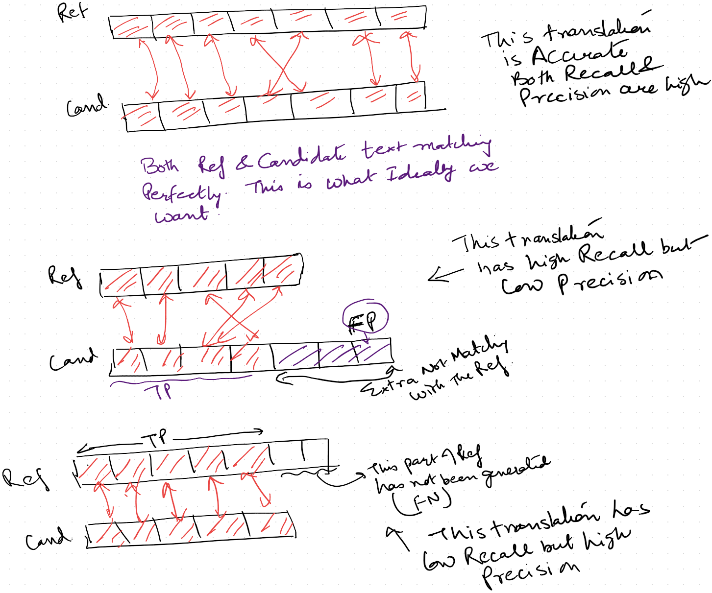

<hr/>


A nice example from "https://medium.com/explorations-in-language-and-learning/metrics-for-nlg-evaluation-c89b6a781054" summarizes it well

 A is more precise than B if the % of A that matches a reference text is higher than B. A’s recall is higher if it contains more matching text from a reference than B. For example

```
Reference: I work on machine learning.

Candidate A: I work.

Candidate B: He works on machine learning
```

In this toy example, A’s precision is higher than B (100% vs. 60%), but B’s recall is higher (60% vs. 40%).


<hr/>

## F1-Score:

This is a derived score based on both precision and recall

PR/(P+R) 

which means it will be high if both Precision and Recall are high. That means algorithm is behaving to give out only correct and complete information


## Results 

We used the classification models that we had developed as part of the texttorch assignment to calculate the Precision, Recall & F1 score
The reason is that in case of the Machine Translation it is often the case that the candidate will generate a word which is semantically similar but its different than what has been used in the reference text. This will bring down the True Positives and hence the Precision & Recall. 
e.g.
```
Ref: The cat is sitting on the mat
Cand: There is a cat on the mat

```

Both Ref and cand are same but if we calculate the precision and recall it is ver low, since the words have changed.

These metrics make sense when there are predefined outputs like __"classes"__. It can only be dog or cat kind of scenarios. 

For that reason we have not used the seq2seq results instead used the binary and mutliclass classsification that we had done as part of torchtext assignment


### Binary Classification
This is using the IMDB dataset

The source code is at https://github.com/TSAI-END3-Group/Session_7_EvalMetrics/blob/master/dataset_IMDB.ipynb 

* Number of classes =2

* Number of training samples=25000

* Number of testing samples=25000

Following are the results on test data
```
Accuracy : 0.850
Precision : 0.8434
Recall: 0.860
F1-Score: 0.8517

```

### Multiclass classification:

The source code is at https://github.com/TSAI-END3-Group/Session_7_EvalMetrics/blob/master/dataset_YelpReviewFull.ipynb

This is using YelpFullReview dataset 
* number of classes=5
* number of training samples=650000
* number of test samples=50000

Following are the results on test data
```
Accuracy : 0.598
Precision : 0.597
Recall: 0.599
F1-Score: 0.598

```


## Perplexity

* Perplexity in its simple terms means how confused the model is. Basically is the model producing gibberish or is it producing sensible output

* In case of the language model, the context is the key. The larger the context the better is the prediction as they work on P(W/Context) i.e given the context what is the next word
Now in case of the unigram the context is only one word so the model has a large number of choices


* For e.g. 
P(?|he)
if model knows that current word is 'he' it can predict 'is','went','was','sat'... and so on

    so the model has many choices and a wrong choice will end up in bad generation

    while if the context is many words like tri-gram or in case of attention the it can be many many words then the model can make correct decisions

    P(?|'he','is','sitting','on')

    now if the model has a context of 'he is sitting on' it can generate 'chair' as that is the most common choice

* In our case we are using the perplexity to check how well the model is predict based on the context which is the combination of __attention__ and __decoder previous hidden state__ context p(W|attention_based_context)


* The perplexity is inverse of accuracy. As the acccuracy keeps going up, the perplexity goes down.
* Mathematically it is calculated as 
    ```
    math.exp(negative_log_likehood_loss)
    ```
    This formula tells that as the value of the loss decreases (accuracy increases then loss decreases) the Perplexity also decreases exponentially. So a small change in accuracy can have a big impact on the perplexity
    
    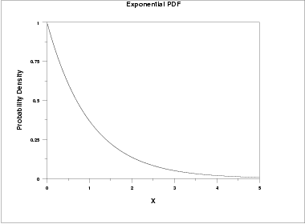


### Results
We made use of the attention based seq2seq model which was developed as part of session6

The source code is at https://github.com/TSAI-END3-Group/Session_7_EvalMetrics/blob/master/Attention_Language_translation.ipynb 

The data used is the French to English translation script. 
We will try to see how well the french sentences have been translated. We will use the training data to check how the model is performing. 
We have a ground truth englsih sentence which we will compare with the model generated english sentence


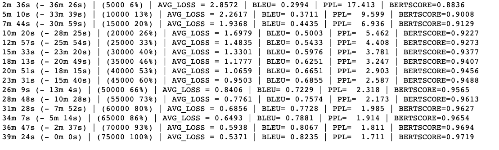

In this case we can clearly see the relationship between the loss and the perplexity. As the loss is going down so is the perplexity. 

Also the decrease in the perplxity is exponential . The loss has gone down gently while Perplexity has gone down exponentially implying small changes to model accuracy reduces the perplexity a lot.

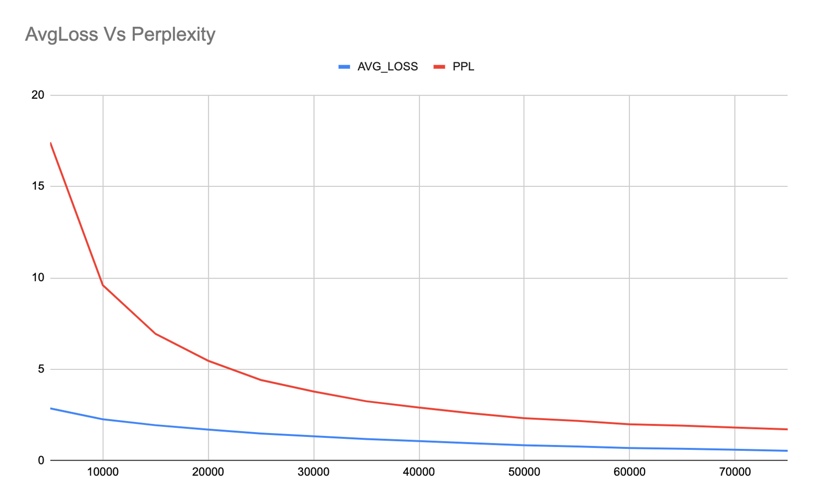


```
The final perplexity is 1.711
```

## BLEU 
https://aclanthology.org/P02-1040.pdf

BLEU can be seen as a solution to some of the issues with the Precision and Recall metrics for Text Data
It can be called as a __weighted n-gram based Precision score__

* One of the problems in using the regular classification metrics like the precision and recall in case of language models is that the metrics are based on just presence or absence of word without checking if the word makes any sense over there or not
    ```
    Ref: The cat is sitting on the mat
    Cand: the the the the the the the 
    ```
    In this case if we try to check for just the presence or absensce of words we will see that all the words in candidate are present in the reference (TP). there is no FP

    TP=7, FP=0
    precision =7/7=1

    However the candidate translation is absurd 

    BLUE fixes this problem by defining a modified Precision. 

    ```
        Precision_modifies=(Max number of times unique candidate words appears in the references)/Total number of words in the Candidate
    ```
    This definition will convert the above precision to 2/7 as 'the' has appeared only 2 times. We will not further consider 'the' for the calculations

* In order to bring in some context BLEU also makes use of the n-grams. We can calculate the BLUE using bi-gram, trigram and so on. A candidate which is very different than the reference will have a very low BLUE score when we use bigrams or trigrams
    ```
    Ref: The cat is on the mat
    Cand: the the the the the the the

    Candidate bigrams:
    the the ...this appears 6 times


    ref bigrams
    the cat,cat is, is on,on the, the mat

    Freq('the the') in reference is 0
    so precision is 0/6 =0
    ```
    so we can see that the candidate will have 0 BLUE score if we use bigrams and will be discarded easily

    In general we will generate the BLUE score using different n-grams and combine them together usng the formula
    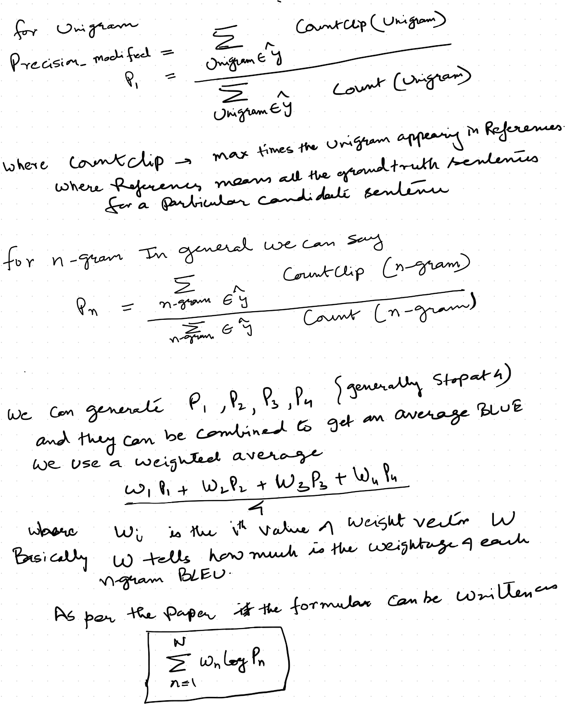


* One more issue that BLUE takes care of is to identify if some Candidates are very small as compared to the references. This is kind of making sure that the Recall is also taken care of. If the candidate length is very small BLUE penalizes it as chances are that some part of the reference will not have been covered. This is called __Brevity Penalty (BP)__
The purpose of BP is to bring down the BLEU score in case it is obvious that the recall is not maintained

    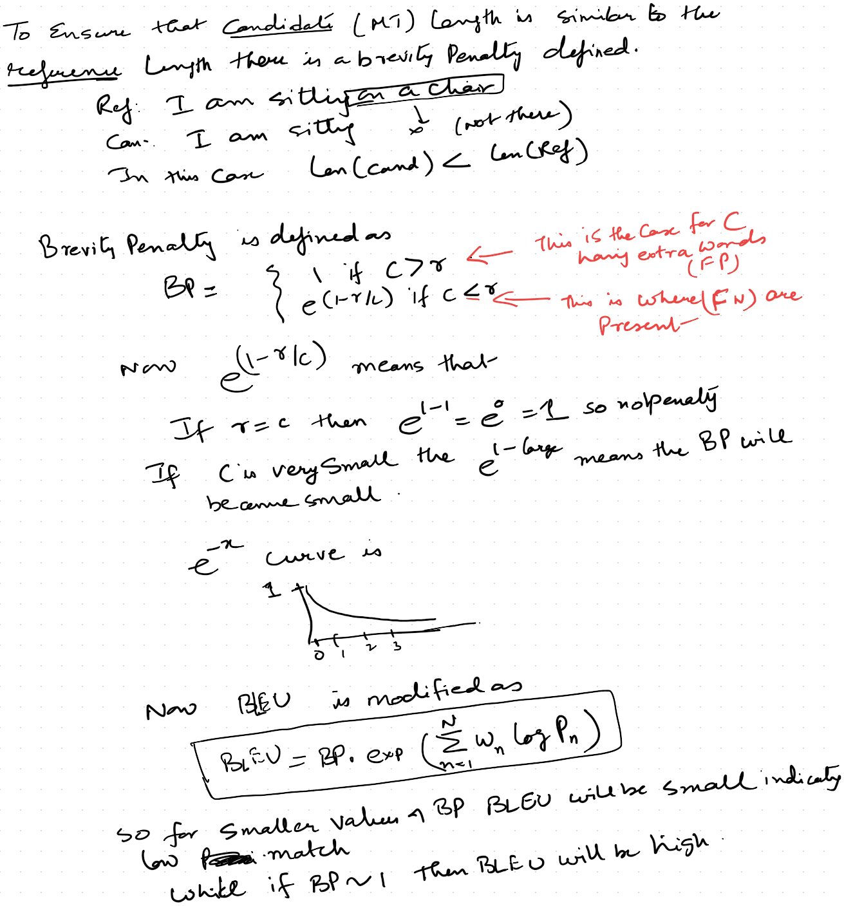


### Results
We made use of the attention based seq2seq model which was developed as part of session6

The source code is at https://github.com/TSAI-END3-Group/Session_7_EvalMetrics/blob/master/Attention_Language_translation.ipynb 


The data used is the French to English translation script. 


We can clearly see that as the loss is going down the BLEU is getting better, indicating that the Reference (ground truth) and the candidates are almost matching on an n-gram basis
we have used a trigram score and then also we have managed to get a good BLEU score which means most of the candidates are very similar to the references 

```
The final BLEU score is 0.8235
```

## BERTSCORE


There are 2 main problems with the BLEU score 

1. There is no semantic understanding  while giving the score.  

```
Ref1: Professor was late due to traffic
Cand1: teacher was late due to congestion on road
```
Now Ref and Cand are semantic similar cases but they have different words hence the BLUE score will be less

One of the reason for the BLEU score to be based on pure word count is because the metrics are designed in 2002 when NLP was mostly n-gram based bag of word analysis. There was very little concept of semantic relations and contexts
Hence this metrics has now become somewhat outdated with most of modern NLP based on context and semantics


2. BLUE is mostly interested in the Precision metrics. The layman interpretation is that is the Y^ able to match all the words that are present in the ground truth (reference) . But recall is also important. That will find out how much of the reference is not even covered by the Candidate. Ideally reference sentences should match completely with the candidate to say that the translation is perfect. It can happen that the candidate is not covering the entire groundtruth that means the candidate is leaving behind certain facts while translating
BLEU tries to account for Recall using Brevity Penalty but that is not enough.


```
Ref: This movie has good story but acting sucks
Cand: This movie has good story

```


The BERTScore tries to handle both the problems by doing the following
1. It makes use of BERT embeddings which are have very strong context capturing ability. So now the semantically correct sentences can also be compared

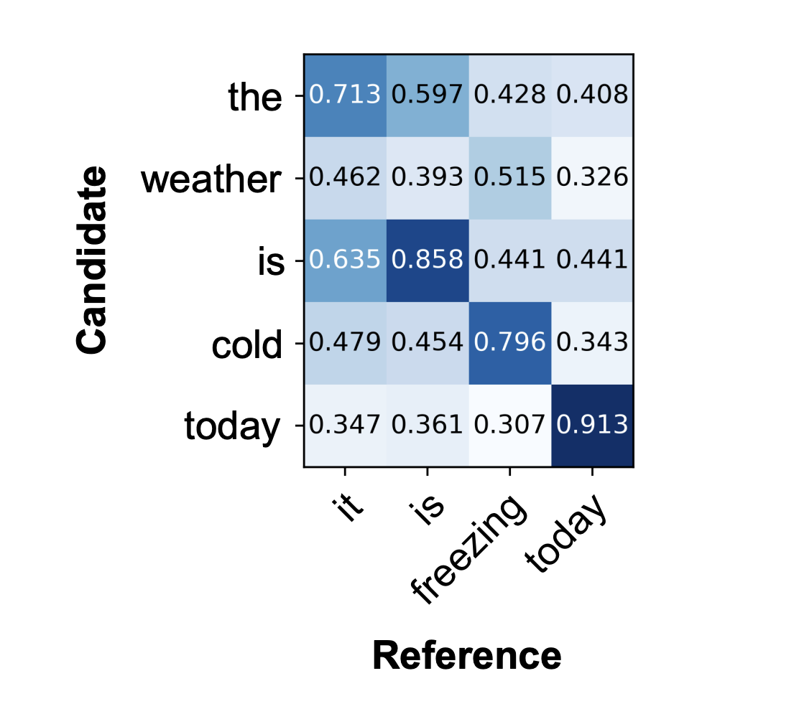

in this case even though 'freezing' is not there in the candidate but cold embedding is getting matched to freezing embedding'

2. While calculating the Score it uses both Precision and Recall and generates a F1 score. This score is what matters

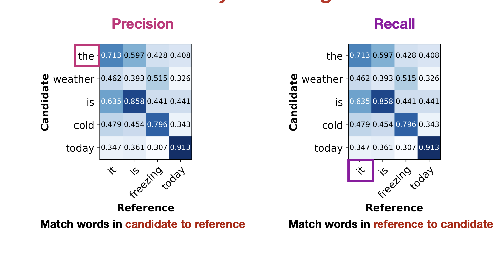


We can see that BERTScore is calculating both Precision Metrics and Recall Metrics

The max numbers from both the correlation matrices are combined to calculate the final score

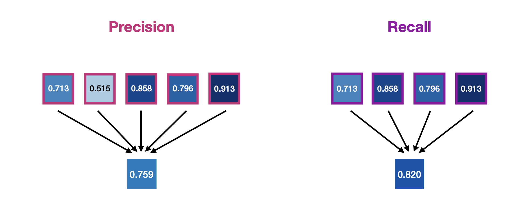


Finally the F1 is calculated as 

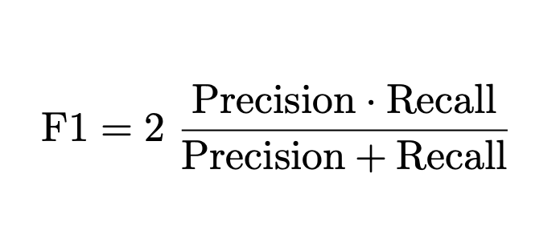


### Results
We made use of the attention based seq2seq model which was developed as part of session6
The source code is at https://github.com/TSAI-END3-Group/Session_7_EvalMetrics/blob/master/Attention_Language_translation.ipynb 


The data used is the French to English translation script. 

We can clearly see that as the loss is going down the BERTScore is getting better, indicating that the Reference (ground truth) and the candidates are almost matching even semantically


We can clearly see BERTSCORE is increasing as the loss is going down. Infact after the 75K samples that we have used for training we can see that BERTScore is almost 1
Where as the BLEU score is 0.82 which means BLEU score is struggling to assess the semantically similar translations

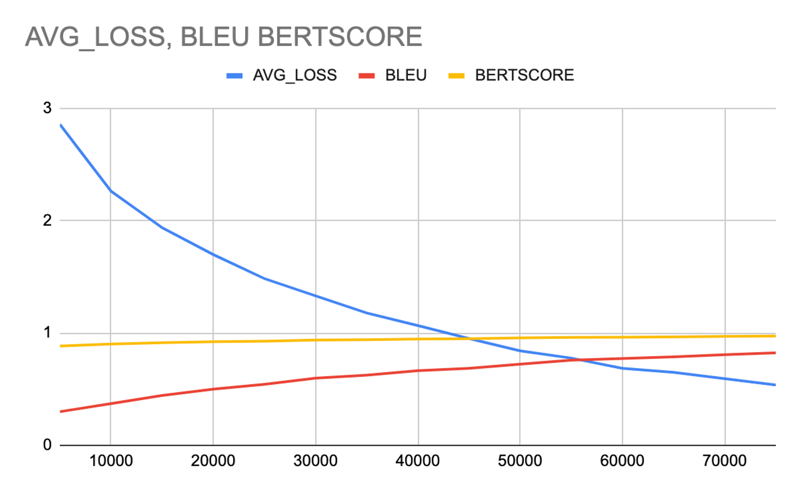

```
The final BERTScore is 0.971
```

# References
1. https://yoavartzi.com/pub/zkwwa-iclr.2020.slides.pdf
2. https://jlibovicky.github.io/2019/05/01/MT-Weekly-BERTScore.html
3. https://aclanthology.org/P02-1040.pdf
4. https://github.com/Tiiiger/bert_score/blob/master/bert_score/score.py


# Contributors
* Rohit Agarwal
* Kushal Gandhi
* Vivek Kumar
* Ammishaddai U